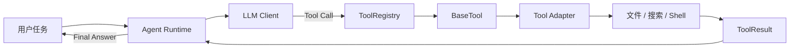
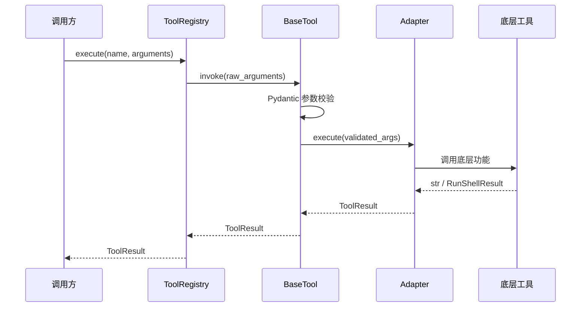
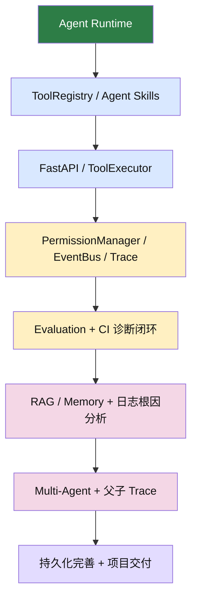

# DevAgent

> 面向研发效能场景的 AI Agent 后端平台

DevAgent 不只是一个调用大模型 API 的聊天机器人。它围绕真实研发工作流，逐步实现代码仓库分析、CI 失败诊断、日志根因分析、安全工具调用、RAG/Memory、执行轨迹回放、Agent Evaluation 和受控多 Agent 编排。

当前项目处于持续开发阶段，已完成工具系统、Mock LLM、真实 LLM 适配层、Agent Loop、基础防失控能力、Agent 事件轨迹、命令行 Demo、FastAPI 服务骨架、任务创建 API、任务状态机与内存任务仓库。

```text
当前进度：ToolResult + ToolRegistry + 内置工具 + MockLLMClient + OpenAICompatibleLLMClient + AgentRuntime + AgentRunResult + AgentEvent + CLI + FastAPI + Task API + AgentTask + InMemoryTaskRepository
测试状态：138 passed
Python 要求：3.11+
```

---

## 项目亮点

| 能力 | 说明 | 状态 |
| --- | --- | --- |
| 统一工具协议 | 使用 `BaseTool`、Pydantic 参数模型和 `ToolResult` 统一工具调用 | 已完成 |
| 文件读取 | 支持行号、读取范围、workspace 路径边界 | 已完成 |
| 代码搜索 | 基于 ripgrep，支持 glob、超时和输出截断 | 已完成 |
| Shell 执行 | 保留 stdout、stderr、returncode，支持超时和 cwd 限制 | 已完成 |
| ToolRegistry | 支持注册、查询、Schema 导出、参数校验和统一执行 | 已完成 |
| Mock LLM | 统一 LLM 协议、固定响应序列、请求记录与离线测试 | 已完成 |
| 真实 LLM 适配层 | OpenAI-compatible client、tools schema 转换、tool_calls 解析 | 已完成基础版 |
| Agent Loop | 多轮推理、工具调用、结果观察、最终回答 | 已完成 |
| 防失控保护 | 结构化运行结果、最大步数、工具调用预算、重复调用检测、LLM 异常兜底 | 已完成基础版 |
| Agent 事件轨迹 | 记录 run、LLM、tool、error 事件，支撑后续 CLI、Trace 和 WebSocket | 已完成基础版 |
| 命令行 Demo | 基于事件流展示 LLM 调用、工具调用、最终回答和失败状态 | 已完成基础版 |
| FastAPI 服务骨架 | 提供应用入口、配置模块、`GET /health` 和 OpenAPI 文档 | 已完成基础版 |
| 任务创建 API | `POST /api/v1/agent/tasks`，返回 `task_id` 和 `PENDING` | 已完成基础版 |
| 任务状态机 | `AgentTask`、`TaskStatus`、合法状态转移和终态保护 | 已完成基础版 |
| 内存任务仓库 | `InMemoryTaskRepository` 支持 create/get/list/update_status，并用副本保护内部状态 | 已完成基础版 |
| Agent Skills | 面向业务组合 ToolRegistry 工具能力，预留 MCP 扩展 | 规划中 |
| 权限审批 | 高风险工具审批、策略管理、危险命令防护 | 规划中 |
| Trace 与事件流 | EventBus、SSE/WebSocket、执行回放 | 规划中 |
| 研发诊断 | CI 失败诊断、日志根因分析、Git diff 分析 | 规划中 |
| RAG / Memory | 代码、日志、CI、文档和历史案例检索，上下文压缩 | 规划中 |
| Evaluation | 工具命中率、证据命中率、延迟、失败率等指标评测 | 规划中 |
| 多 Agent 编排 | 子任务拆分、并发、预算限制、取消传播 | 规划中 |

---

## 工作原理



当前已实现的工具调用链：



---

## 快速开始

### 1. 创建并激活虚拟环境

```bash
python3 -m venv .venv
source .venv/bin/activate
```

### 2. 安装依赖与项目

```bash
python -m pip install -r requirements.txt
python -m pip install -e .
```

`-e` 表示 editable install。修改 `src/devagent` 中的源码后，无需重新安装。

### 3. 运行测试

```bash
pytest -q
```

预期结果：

```text
138 passed
```

代码搜索工具依赖 [ripgrep](https://github.com/BurntSushi/ripgrep)。请确保本机可以运行：

```bash
rg --version
```

---

## 命令行 Demo

安装 editable 包后，可以运行：

```bash
devagent "请分析项目" --workspace .
```

也可以直接使用模块入口：

```bash
python -m devagent.cli "请分析项目" --workspace .
```

输出会展示 LLM 调用、工具调用和最终回答。失败场景会返回非 0 退出码并输出中文错误。

真实 LLM 使用显式开关启用：

```bash
export DEVAGENT_LLM_API_KEY="你的 key"
export DEVAGENT_LLM_MODEL="你的模型名"
devagent "请分析项目中的 ToolRegistry" --workspace . --provider real
```

`real` 模式当前只向模型暴露低风险工具，避免在 PermissionManager 完成前让真实模型直接调用高风险 Shell 工具。

---

## 使用示例

通过默认 Registry 调用工具：

```python
from devagent.tools.builtin import create_builtin_registry

registry = create_builtin_registry()

result = registry.execute(
    "read_file",
    {
        "file_path": "pyproject.toml",
        "start_line": 1,
        "end_line": 10,
        "workspace": ".",
    },
)

print(result.content)
```

搜索代码：

```python
result = registry.execute(
    "search_code",
    {
        "query": "ToolRegistry",
        "workspace": ".",
        "file_pattern": "*.py",
    },
)
```

执行命令：

```python
result = registry.execute(
    "run_shell",
    {
        "command": ["pytest", "-q"],
        "cwd": ".",
        "workspace": ".",
        "timeout": 30,
    },
)

print(result.metadata["returncode"])
print(result.metadata["stdout"])
```

> `run_shell` 已标记为 `HIGH` 风险工具。PermissionManager 完成后，高风险调用将必须经过审批。

---

## 核心设计

### ToolResult

所有工具最终返回统一结果：

```json
{
  "success": true,
  "content": "1: [build-system]",
  "metadata": {
    "path": "pyproject.toml"
  },
  "error_code": null,
  "error_message": null
}
```

稳定错误码用于程序判断，中文错误信息用于阅读。调用方不需要解析错误文本。

### BaseTool

`BaseTool` 统一负责：

```text
工具名称与描述
Pydantic 参数模型
风险等级
参数校验
未预期异常保护
工具 Schema 导出
```

### ToolRegistry

`ToolRegistry` 只依赖 `BaseTool` 协议，不依赖具体工具实现：

```text
register：注册工具
get：查询工具
list：稳定排序展示工具
schemas：导出工具 Schema
execute：按名称统一执行工具
```

新增工具时，只需实现新的 `BaseTool` 并在应用组装阶段注册。

---

## 项目结构

```text
DevAgent/
├── src/devagent/tools/
│   ├── models.py              # ToolResult、ErrorCode、RiskLevel
│   ├── base.py                # BaseTool
│   ├── registry.py            # ToolRegistry
│   ├── builtin.py             # 内置工具包装与默认 Registry
│   ├── adapters.py            # 底层结果到 ToolResult 的适配
│   ├── read_file_tools.py     # 文件读取
│   ├── search_code_tools.py   # 代码搜索
│   └── run_shell_tools.py     # 命令执行
├── tests/tools/               # 工具系统测试
├── tests/task/                # 任务模型与任务仓库测试
├── docs/learning/             # 每日学习与验收记录
├── plan.md                    # 项目设计文档
└── learning_plan.md           # 八周开发学习计划
```

---

## 开发路线



详细资料：

- [项目设计文档](plan.md)
- [开发学习计划](learning_plan.md)
- [学习与验收记录](docs/learning/README.md)

---

## 设计原则

```text
不依赖 LLM 自觉保证安全，所有工具参数都由后端校验。
底层工具保持单一职责，Agent 层通过 ToolResult 统一处理。
高风险能力必须支持权限审批、超时、路径限制和审计。
所有 Agent 结论应尽量引用代码、日志、CI 或 Git diff 证据。
先完成可测试的单 Agent 闭环，再实现多 Agent 编排。
```

---

## License

本项目当前用于个人学习、工程实践与求职作品展示。
