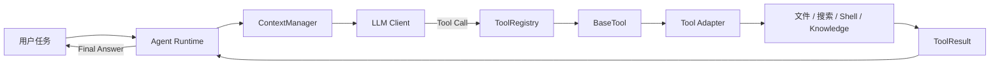
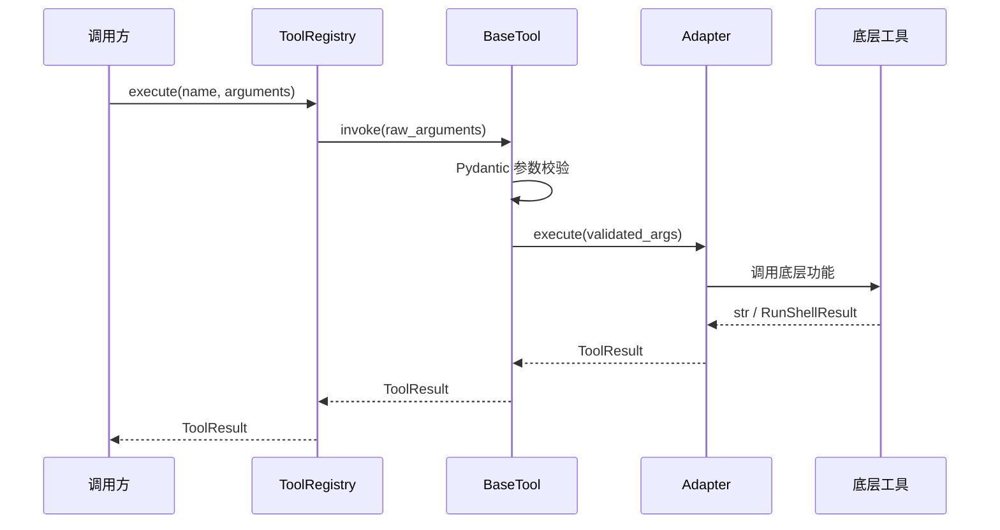
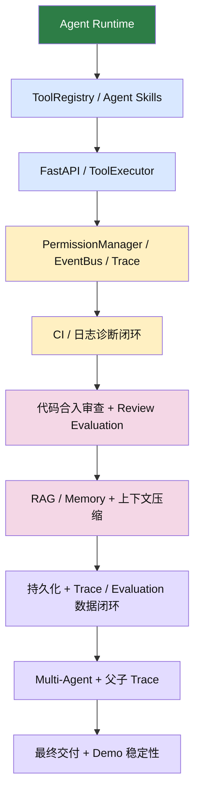

# DevAgent

> 面向研发效能场景的 AI Agent 后端平台

DevAgent 不只是一个调用大模型 API 的聊天机器人。它围绕真实研发工作流，逐步实现代码仓库分析、CI 失败诊断、日志根因分析、安全工具调用、RAG/Memory、执行轨迹回放、Agent Evaluation 和受控多 Agent 编排。

当前项目处于持续开发阶段，已完成工具与权限执行链、Agent Runtime、任务 API、EventBus、SSE/WebSocket、Trace 回放、CI / Git / 日志工具、证据驱动诊断、代码合入审查，以及 BM25、向量、Hybrid RRF、可降级 Rerank 和上下文压缩。第十周进一步完成 SQLite 持久化闭环，任务、结构化事件与序号、工具调用、权限请求/策略、Evaluation 运行、GitHub delivery 与审查发布状态均可跨进程恢复。RAG 已完成 36 条路径级固定集对比、两次真实 Agent 正负样本稳定性验收，并将开放式 Agent、领域业务和高价值重排拆分为不同默认策略。CI Diagnosis、Log Diagnosis 和 Local Code Review 也已通过固定证据完成真实 provider 验收。其余业务链路的真实验收状态单独列出，不用 Mock 结果代替。项目同时提供 React 可视化控制台，用于查看任务、事件流、Trace、权限请求、诊断报告和 GitHub PR 建议状态。

```text
当前进度：Agent Runtime + Tool/Permission/Event/Trace + Diagnosis/Review + 分场景 RAG + ContextManager + 离线/真实 Evaluation + React Console
当前阶段：第 10 周持久化数据闭环已完成；下一阶段进入 Multi-Agent 基础闭环与父子 Trace
测试状态：使用 `uv run --locked pytest -q` 执行全量回归
Python 要求：3.11+
环境管理：uv + `pyproject.toml` + `uv.lock`
```

---

## 项目亮点

| 能力 | 说明 | 状态 |
| --- | --- | --- |
| 统一工具协议 | 使用 `BaseTool`、Pydantic 参数模型和 `ToolResult` 统一工具调用 | 已完成 |
| 文件读取 | 支持行号、读取范围、workspace 路径边界 | 已完成 |
| 代码搜索 | 基于 ripgrep，支持 glob、超时和输出截断 | 已完成 |
| Shell 执行 | 保留 stdout、stderr、returncode，支持超时和 cwd 限制 | 已完成 |
| ToolRegistry | 支持注册、查询、Schema 导出、参数校验和统一执行 | 已完成 |
| ToolExecutor | 对工具调用返回 `EXECUTED`、`BLOCKED`、`WAITING_PERMISSION`，高风险工具接入权限前置链 | 已完成基础版 |
| 工具 Schema | 从 `BaseTool.args_model` 和 `risk_level` 自动导出统一内部工具协议 | 已完成 |
| 权限领域模型 | `PermissionRequest`、`PermissionDecision`、`PermissionStatus`、`PermissionPolicy` | 已完成基础版 |
| 内存权限管理器 | `InMemoryPermissionManager` 支持创建、查询、审批、列出待审批请求 | 已完成基础版 |
| 内存权限策略匹配 | `InMemoryPermissionPolicyStore` 支持 always allow / deny 的工具名、风险等级和参数指纹匹配 | 已完成基础版 |
| 权限审批 API | 支持查询待审批请求、查询详情、批准 / 拒绝和重复审批冲突处理 | 已完成基础版 |
| 危险命令拦截 | `CommandGuard` 拦截 `rm -rf /`、`sudo`、`mkfs`、`dd`、`curl/wget \| sh` 等明显危险调用 | 已完成基础版 |
| 统一事件协议 | `BaseEvent`、`EventType`、Agent/LLM/Tool/Permission 事件模型、`sequence_id` 和敏感字段脱敏 | 已完成基础版 |
| 内存 EventBus | 支持事件发布订阅、多订阅者投递、失败隔离、历史查询和基于 `sequence_id` 的补发 | 已完成基础版 |
| Mock LLM | 统一 LLM 协议、固定响应序列、请求记录与离线测试 | 已完成 |
| 真实 LLM 适配层 | OpenAI-compatible client、tools schema 转换、tool_calls 解析 | 已完成基础版 |
| Agent Loop | 多轮推理、工具调用、结果观察、最终回答 | 已完成 |
| 防失控保护 | 结构化运行结果、最大步数、工具调用预算、重复调用检测、LLM 异常兜底 | 已完成基础版 |
| Agent 事件轨迹 | 记录 run、LLM、tool、error 事件，支撑后续 CLI、Trace 和 WebSocket | 已完成基础版 |
| 命令行 Demo | 基于事件流展示 LLM 调用、工具调用、最终回答和失败状态 | 已完成基础版 |
| FastAPI 服务骨架 | 提供应用入口、配置模块、`GET /health` 和 OpenAPI 文档 | 已完成基础版 |
| 任务创建 API | `POST /api/v1/agent/tasks`，返回 `task_id` 和 `PENDING` | 已完成基础版 |
| 任务查询/取消 API | 支持查询任务详情、取消任务、404 和 409 状态冲突处理 | 已完成基础版 |
| 任务状态机 | `AgentTask`、`TaskStatus`、合法状态转移和终态保护 | 已完成基础版 |
| 内存任务仓库 | `InMemoryTaskRepository` 支持 create/get/list/update_status，并用副本保护内部状态 | 已完成基础版 |
| 后台任务执行 | `TaskManager` 编排 AgentRuntime，创建任务后后台推进到 DONE / FAILED | 已完成基础版 |
| 任务事件查询 | `InMemoryEventStore` 保存 Agent events，支持按 task_id 查询执行轨迹 | 已完成基础版 |
| 多任务集成测试 | 验证任务状态隔离、事件隔离、取消语义和第三周 API 闭环 | 已完成基础版 |
| SQLite 持久化 | 任务、结构化事件/序号、工具调用、权限请求/策略和 Trace 可跨进程恢复 | 已完成第 10 周验收 |
| Evaluation 历史 | 保存完整脱敏 run、指标与模型配置，支持同类基线比较 API | 已完成第 10 周验收 |
| GitHub 幂等状态 | delivery 原子 claim、PR head 发布去重与外部 comment locator 持久化 | 已完成第 10 周验收 |
| Git / CI / 日志工具 | 支持受限 Git diff、压缩 CI 失败证据和结构化日志检索 | 已完成基础版 |
| SSE / WebSocket | 支持任务事件实时推送、断开清理和历史事件衔接 | 已完成基础版 |
| Trace 查询 | 将事件流聚合为任务摘要和可回放步骤 | 已完成基础版 |
| 诊断执行服务 | 证据标准化、LLM 调用、Pydantic 报告校验和失败降级 | 已完成基础版 |
| CI 诊断 API | 代码化证据采集、服务端权威字段绑定、结构化报告和真实 provider 验收 | 已完成真实验收 |
| 日志诊断 API | 结构化日志时间线、首异常/连锁错误区分、置信边界和真实 provider 验收 | 已完成真实验收 |
| 代码审查服务与 API | merge-base diff、证据驱动 finding、结构化重试与 `POST /api/v1/reviews/code` | 已完成真实验收 |
| GitHub PR 建议模式 | 签名校验、delivery 幂等、installation token、摘要 upsert 与 inline comment | 已完成真实验收 |
| Review Evaluation | 固定 case、风险召回率、可行动准确率、误报率、证据与 diff 定位指标 | 已完成基线 |
| BM25 RAG / Memory | 稳定切片、证据定位、关键词检索和 `knowledge_retrieve` 工具 | 已完成基线 |
| Agent ContextManager | 保留完整历史，为 LLM 请求生成带原子工具块和关键 evidence 的压缩视图 | 已完成基础版 |
| RAG Evaluation | 36 条路径级离线 case 统计 Hit、Precision、Recall、NDCG、MRR、拒答、上下文与延迟；8 条真实 Agent case 重复 2 次 | 已完成第 9 周验收 |
| RAG 检索策略 | BM25、Vector、Hybrid RRF 与可降级 LLM Rerank；使用硬门槛与软排序选择分场景默认 | 已完成增强版 |
| 可视化控制台 | React 页面展示任务、事件、Trace、权限和诊断结果 | 已完成初版 |
| Agent Skills | 面向业务组合 ToolRegistry 工具能力，预留 MCP 扩展 | 规划中 |
| 权限审批 | 高风险工具审批、策略管理、危险命令防护和审批 API | 已完成基础版 |
| Trace 与事件流 | 统一事件协议、EventBus、SSE/WebSocket、执行回放 | 已完成基础版 |
| 研发诊断 | CI 失败诊断契约与 API、日志根因分析契约、Git diff 分析 | 已完成基础版 |
| 代码合入审查 | base/head 变更审查、结构化建议和 Review Evaluation | 自动化闭环完成 |
| RAG / Memory | 代码、日志、CI、文档和历史案例的关键词、向量、混合检索、重排与上下文压缩 | 已完成增强版 |
| Evaluation | Review 与 RAG 固定基线、分级排序质量、拒答、上下文、延迟和真实稳定性报告 | 已完成增强版 |
| 多 Agent 编排 | 子任务拆分、并发、预算限制、取消传播 | 规划中 |

---

## 真实验收状态

Mock、固定响应和 Fake HTTP Client 只用于可重复测试。下面单独记录真实模型和真实平台链路：

| 业务链路 | 确定性自动化 | 真实端到端 | 当前证据 |
| --- | --- | --- | --- |
| RAG Agent | 已完成 | 同配置 8 条代表性 case 完成 2 次稳定性验收 | `rag_optimization.md/json` + 单次 MD/JSON |
| CI Diagnosis API | 已完成 | 修复后连续 3 次通过 | `ci_diagnosis_live_summary.md` + 单次 MD/JSON |
| Log Diagnosis | 已完成 | 固定结构化日志真实 API 与 runner 验收通过 | `log_diagnosis_live_summary.md` + MD/JSON |
| Local Code Review | 已完成 | 固定本地变更真实 provider 验收通过 | `code_review_live_summary.md` + 单次 MD/JSON |
| GitHub PR Review | 已完成 | 真实 App、PR、webhook、模型分析和评论回写通过 | `github_pr_smoke.md` |

本次真实 RAG Agent 基线：

```text
Model / API：gpt-5.6-terra / Responses
Cases：8
knowledge_retrieve Tool Call Rate：100%
Evidence Hit Rate：100%
Grounded Citation Rate：100%
Abstention Accuracy：100%
严格 End-to-End Success Rate：87.5%（7 / 8）
End-to-End p95：24.55 秒
```

本次真实 CI Diagnosis 验收：

```text
Model / API：gpt-5.6-terra / Responses
Case：commit 7229c86 的 unit-tests 失败
修复后连续成功率：100%（3 / 3）
CI + Git Evidence Coverage：100%
Grounded Evidence References：100%
Expected Keyword Hit Rate：100%
平均延迟：17.18 秒
p95：20.97 秒
```

本次真实 Local Code Review 验收：

```text
Model / API：gpt-5.6-terra / Responses
Case：7229c86^...7229c86 的上传超时回归
Git + Code Evidence Coverage：100%
Grounded Evidence References：100%
Expected Finding Match：100%
Expected Keyword Hit Rate：100%（2 / 2）
额外 Finding：0
端到端延迟：15.79 秒
```

本次真实 Log Diagnosis 验收：

```text
Model / API：gpt-5.6-terra / Responses
Case：task_001 上传超时与重试失败日志
Log Evidence Coverage：100%
Grounded Evidence References：100%
首个异常 / 连锁错误识别：100%
Confirmed Root Cause：0
代码证据缺口记录：100%
Expected Keyword Hit Rate：100%（3 / 3）
端到端延迟：34.19 秒
```

本次真实 GitHub PR Review 验收：

```text
专用测试仓库：Dracarys6/devagent-review-smoke#1
触发事件：opened、synchronize、redelivery
真实模型结果：定位 1 个 HIGH security finding
评论结果：1 条可更新摘要 + 1 条 inline comment
重复 delivery 去重率：100%
摘要评论重复数：0
真实 webhook 到摘要发布延迟：37.2 秒（目标 < 60 秒）
```

---

## 工作原理


```mermaid
flowchart LR
    User[用户任务] --> Agent[Agent Runtime]
    Agent --> Context[ContextManager]
    Context --> LLM[LLM Client]
    LLM -->|Tool Call| Registry[ToolRegistry]
    Registry --> Tool[BaseTool]
    Tool --> Adapter[Tool Adapter]
    Adapter --> Builtin[文件 / 搜索 / Shell / Knowledge]
    Builtin --> Result[ToolResult]
    Result --> Agent
    Agent -->|Final Answer| User
```

当前已实现的工具调用链：


```mermaid
sequenceDiagram
    participant C as 调用方
    participant R as ToolRegistry
    participant T as BaseTool
    participant A as Adapter
    participant F as 底层工具

    C->>R: execute(name, arguments)
    R->>T: invoke(raw_arguments)
    T->>T: Pydantic 参数校验
    T->>A: execute(validated_args)
    A->>F: 调用底层功能
    F-->>A: str / RunShellResult
    A-->>T: ToolResult
    T-->>R: ToolResult
    R-->>C: ToolResult
```

---

## 快速开始

### 一键启动前后端

首次克隆先运行 `./scripts/setup.sh` 同步后端与前端依赖，之后在项目根目录执行：

```bash
./scripts/start.sh
```

脚本会启动 FastAPI 后端与 Vite 前端，确认服务就绪后默认打开
`http://127.0.0.1:5173`。按 `Ctrl+C` 会同时停止两个服务。

如不希望自动打开浏览器：

```bash
./scripts/start.sh --no-open
```

查看完整参数：

```bash
./scripts/start.sh --help
```

### 1. 安装 uv

按照 [uv 官方安装文档](https://docs.astral.sh/uv/getting-started/installation/) 安装后确认命令可用：

```bash
uv --version
```

### 2. 同步开发环境

```bash
./scripts/setup.sh
```

脚本执行 `uv sync --locked`，根据 `.python-version`、`pyproject.toml` 和 `uv.lock`
创建 `.venv`、安装 editable 项目与开发依赖，然后通过 `npm ci` 安装前端依赖。日常只修改
Python 依赖时，可以直接运行：

```bash
uv sync --locked
```

新增运行依赖使用 `uv add <package>`，新增开发依赖使用 `uv add --dev <package>`；两条命令会同时
更新项目元数据和锁文件。

### 3. 运行测试

```bash
uv run --locked pytest -q
```

预期结果：全部测试通过；具体数量以当前分支输出为准。

代码搜索工具依赖 [ripgrep](https://github.com/BurntSushi/ripgrep)。请确保本机可以运行：

```bash
rg --version
```

---

## 命令行 Demo

安装 editable 包后，可以运行：

```bash
uv run --locked devagent "请分析项目" --workspace .
```

也可以直接使用模块入口：

```bash
uv run --locked python -m devagent.cli "请分析项目" --workspace .
```

输出会展示 LLM 调用、工具调用和最终回答。失败场景会返回非 0 退出码并输出中文错误。

真实 LLM 使用显式开关启用：

```bash
export DEVAGENT_LLM_API_KEY="你的 key"
export DEVAGENT_LLM_MODEL="你的模型名"
uv run --locked devagent "请分析项目中的 ToolRegistry" --workspace . --provider real
```

`real` 模式默认只向模型暴露低风险工具。高风险工具需要通过 ToolExecutor、CommandGuard 和 PermissionManager 审批链显式接入。

---

## 使用示例

调用 CI 诊断 API：

```bash
curl -X POST http://127.0.0.1:8000/api/v1/diagnoses/ci \
  -H 'Content-Type: application/json' \
  -d '{"commit_id":"abc123","workspace":"examples/sample_repo"}'
```

报告使用 `Evidence`、`Finding` 和 `MissingEvidence` 区分已确认症状、推断和缺失证据。自动化测试使用固定 LLM 响应，不访问真实模型网络。

GitHub Pull Request 建议模式接收签名 webhook，并提供任务状态查询：

```text
POST /api/v1/integrations/github/webhooks
GET  /api/v1/integrations/github/review-tasks/{task_id}
```

真实 GitHub App 只申请 `Metadata: Read`、`Contents: Read` 和
`Pull requests: Read and write`。专用测试仓库的配置、只读探测和 opened / synchronize /
redelivery 验收步骤见 [`docs/evaluation/github_pr_smoke.md`](docs/evaluation/github_pr_smoke.md)。

通过默认 Registry 调用工具：

```python
from devagent.tools.builtin import create_builtin_registry

registry = create_builtin_registry()

result = registry.execute(
    "read_file",
    {
        "file_path": "pyproject.toml",
        "start_line": 1,
        "end_line": 10,
        "workspace": ".",
    },
)

print(result.content)
```

搜索代码：

```python
result = registry.execute(
    "search_code",
    {
        "query": "ToolRegistry",
        "workspace": ".",
        "file_pattern": "*.py",
    },
)
```

执行命令：

```python
result = registry.execute(
    "run_shell",
    {
        "command": ["uv", "run", "--locked", "pytest", "-q"],
        "cwd": ".",
        "workspace": ".",
        "timeout": 30,
    },
)

print(result.metadata["returncode"])
print(result.metadata["stdout"])
```

> `run_shell` 已标记为 `HIGH` 风险工具。PermissionManager 完成后，高风险调用将必须经过审批。

---

## 核心设计

### ToolResult

所有工具最终返回统一结果：

```json
{
  "success": true,
  "content": "1: [build-system]",
  "metadata": {
    "path": "pyproject.toml"
  },
  "error_code": null,
  "error_message": null
}
```

稳定错误码用于程序判断，中文错误信息用于阅读。调用方不需要解析错误文本。

### BaseTool

`BaseTool` 统一负责：

```text
工具名称与描述
Pydantic 参数模型
风险等级
参数校验
未预期异常保护
工具 Schema 导出
```

### ToolRegistry

`ToolRegistry` 只依赖 `BaseTool` 协议，不依赖具体工具实现：

```text
register：注册工具
get：查询工具
list：稳定排序展示工具
schemas：导出工具 Schema
execute：按名称统一执行工具
```

新增工具时，只需实现新的 `BaseTool` 并在应用组装阶段注册。

---

## 项目结构

```text
DevAgent/
├── frontend/                   # React 可视化控制台
├── src/devagent/agent/         # AgentRuntime 与 ContextManager
├── src/devagent/diagnosis/     # 诊断模型与执行服务
├── src/devagent/eval/          # RAG / Review Evaluation 计算
├── src/devagent/event/         # EventBus、事件模型和存储
├── src/devagent/memory/        # Document、Chunk 与 BM25 Retriever
├── src/devagent/trace/         # Trace 聚合与回放
├── src/devagent/tools/
│   ├── models.py              # ToolResult、ErrorCode、RiskLevel
│   ├── base.py                # BaseTool
│   ├── registry.py            # ToolRegistry
│   ├── builtin.py             # 内置工具包装与默认 Registry
│   ├── adapters.py            # 底层结果到 ToolResult 的适配
│   ├── read_file_tools.py     # 文件读取
│   ├── search_code_tools.py   # 代码搜索
│   └── run_shell_tools.py     # 命令执行
├── eval/
│   ├── cases/                 # 固定 RAG / Review Evaluation 数据集
│   └── reports/               # 可审查的 baseline 报告
├── scripts/                   # 基线报告与开发辅助脚本
├── tests/                     # 单元与集成测试
├── docs/evaluation.md         # Evaluation 口径、结果与边界
├── docs/learning/             # 每日学习与验收记录
├── pyproject.toml             # 项目元数据与直接依赖
├── uv.lock                    # uv 可复现依赖锁文件
├── plan.md                    # 项目设计文档
└── learning_plan.md           # 八周开发学习计划
```

---

## 开发路线


```mermaid
flowchart TD
    A[Agent Runtime]
    A --> B[ToolRegistry / Agent Skills]
    B --> C[FastAPI / ToolExecutor]
    C --> D[PermissionManager / EventBus / Trace]
    D --> E[CI / 日志诊断闭环]
    E --> F[代码合入审查 + Review Evaluation]
    F --> G[RAG / Memory + 上下文压缩]
    G --> H[持久化 + Trace / Evaluation 数据闭环]
    H --> I[Multi-Agent + 父子 Trace]
    I --> J[最终交付 + Demo 稳定性]

    style A fill:#2d7d46,color:#fff
    style B fill:#d9e8ff,color:#111
    style C fill:#d9e8ff,color:#111
    style D fill:#fff0c2,color:#111
    style E fill:#fff0c2,color:#111
    style F fill:#f4d7e6,color:#111
    style G fill:#f4d7e6,color:#111
    style H fill:#e3dcff,color:#111
    style I fill:#e3dcff,color:#111
    style J fill:#e3dcff,color:#111
```

详细资料：

- [项目设计文档](plan.md)
- [数据库与持久化设计](docs/database.md)
- [开发学习计划](learning_plan.md)
- [Evaluation 指标与基线](docs/evaluation.md)
- [RAG Evaluation Baseline](eval/reports/rag_baseline.md)
- [RAG 第 9 周优化与策略验收](eval/reports/rag_optimization.md)
- [真实 RAG Agent Evaluation](eval/reports/rag_live_provider.md)
- [真实 CI Diagnosis 验收汇总](eval/reports/ci_diagnosis_live_summary.md)
- [真实 Log Diagnosis 验收汇总](eval/reports/log_diagnosis_live_summary.md)
- [真实 Local Code Review 验收汇总](eval/reports/code_review_live_summary.md)
- [学习与验收记录](docs/learning/README.md)

---

## 设计原则

```text
不依赖 LLM 自觉保证安全，所有工具参数都由后端校验。
底层工具保持单一职责，Agent 层通过 ToolResult 统一处理。
高风险能力必须支持权限审批、超时、路径限制和审计。
所有 Agent 结论应尽量引用代码、日志、CI 或 Git diff 证据。
先完成可测试的单 Agent 闭环，再实现多 Agent 编排。
```

---

## License

本项目当前用于个人学习、工程实践与求职作品展示。
